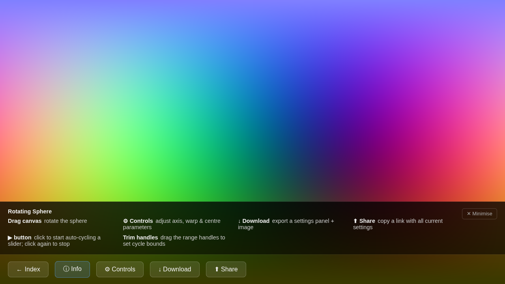
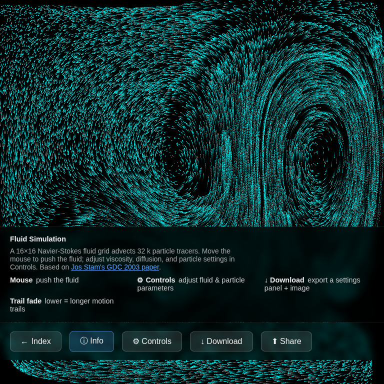
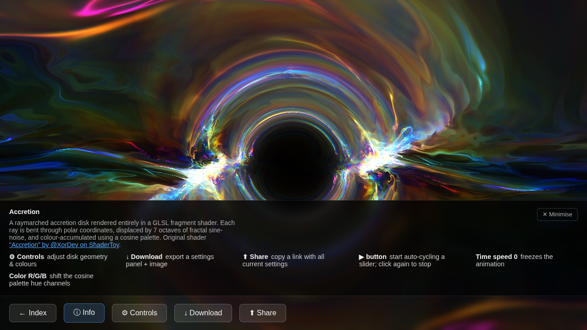

# somej5sketches

Live demo: **<https://blubalubbin.github.io/somej5sketches/>**

A small catalogue of interactive [p5.js](https://p5js.org/) sketches, served as a
static site via GitHub Pages — no build step and no dependencies beyond the p5
CDN.

Every sketch runs inside the same interactive shell: a HUD bar, a collapsible
controls panel with auto-cycling sliders, shareable links and a screenshot
export. That shared interface is described once in
[Shared interface](#shared-interface); the per-sketch sections below cover only
what makes each sketch different.

---

## Sketches

### [Rotating sphere](rotating-sphere-v2/)

<!-- Screenshot: drop a PNG at docs/screenshots/rotating-sphere.png and uncomment -->
<!--  -->

A unit sphere whose surface normals are mapped to RGB colour channels and then
rotated by a configurable axis using a Rodrigues rotation matrix. Drag the
canvas to spin it by hand. Two design choices shape the colour field:

1. **Coordinate-centre offset** — a 3-vector `(cx, cy, cz)` is subtracted from
   each surface normal *before* the warp is applied, shifting which region of
   the complex-power function is sampled.
2. **Warp before renormalisation** — after the warp the vector is renormalised
   to unit length before the rotation. This keeps the output in `[0, 255]` and
   lets the exponent shape the *direction* of the normal rather than its
   magnitude.

#### Render pipeline

```
surface normal  n  (unit sphere)
        │
        ▼  subtract centre
   u = n − (cx, cy, cz)
        │
        ▼  complex-power warp  (element-wise)
   w = sign(u) · |u|^a · cos(b · ln|u|)
        │
        ▼  renormalise
   n̂ = w / ‖w‖
        │
        ▼  Rodrigues rotation
   n̂' = R · n̂
        │
        ▼  map  [-1, 1]  →  [0, 255]
   pixel RGB = n̂' × 127.5 + 127.5
```

With `cx=cy=cz=0`, `a=1` and `b=0` the warp is the identity and the renormalise
step is a no-op, so the sphere shows the raw normal-to-colour mapping.

#### Controls

| Section | Slider | Effect |
|---------|--------|--------|
| Rotation | Polar θ / Azimuth φ | Direction of the rotation axis in spherical coordinates |
| Rotation | Rotation | Angle about the axis (auto-cycle it for a continuous spin) |
| Colour warp | Exponent a | Real part of the complex power — compresses or sharpens the colour bands |
| Colour warp | Imaginary b | Imaginary part — creates oscillating colour rings |
| Coordinate centre | Centre R / G / B | Shifts the warp origin along each colour-channel axis |

#### RGB-space overlay

While a parameter changes — dragged by hand or advanced by a ▶ play button — a
3D wireframe fades in over the render and relates the flat colour map back to a
shape. The unit sphere is sampled on a coarse grid and pushed through the warp
*without* the final renormalise step, so the points genuinely bulge away from a
sphere; each vertex is tinted with the exact pixel colour it produces, so the
cloud literally sits in RGB space. Fixed R/G/B axes, faint unit-sphere great
circles (the natural colour bound), a bounding box and the rotation axis are all
drawn, with overshoot past unit length highlighted. A button toggles between a
filled **surface** mesh and individual **dots**.

---

### [Fluid simulation](fluid-simulation/)

<!-- Screenshot: drop a PNG at docs/screenshots/fluid-simulation.png and uncomment -->
<!--  -->

An interactive Navier-Stokes fluid solver based on
[Jos Stam's GDC 2003 paper](http://www.dgp.toronto.edu/people/stam/reality/Research/pdf/GDC03.pdf).
A coarse velocity/density grid advects ~32 k particle tracers; move the mouse to
push the fluid and watch the tracers stream through the flow.

#### Controls

| Section | Slider | Effect |
|---------|--------|--------|
| Fluid physics | Viscosity | How quickly the velocity field diffuses |
| Fluid physics | Diffusion | How quickly density spreads |
| Fluid physics | Force scale | Strength of the push applied by the mouse |
| Fluid physics | Max mouse vel | Caps the velocity injected per frame |
| Particles | Hue | Base colour of the tracers |
| Particles | Trail fade | Lower = longer motion trails |

---

### [Accretion](accretion/)

<!-- Screenshot: drop a PNG at docs/screenshots/accretion.png and uncomment -->
<!--  -->

A raymarched accretion disk rendered entirely in a GLSL fragment shader. Each
ray is bent through polar coordinates, displaced by several octaves of fractal
sine-noise and colour-accumulated using a cosine palette. Adapted from
[“Accretion” by @XorDev on ShaderToy](https://www.shadertoy.com/view/WcKXDV).

#### Controls

| Section | Slider | Effect |
|---------|--------|--------|
| Accretion disk | Radial scale | Radial density of the disk structure |
| Accretion disk | Depth fade | Falloff of brightness with distance |
| Accretion disk | Angle squish | Flattens the disk along its angular axis |
| Accretion disk | Ray offset | Shifts the ray origin through the field |
| Appearance | Time speed | Animation rate (0 freezes the scene) |
| Appearance | Color R / G / B | Shift the cosine palette per channel |

---

### [Starship](starship/)

<!-- Screenshot: drop a PNG at docs/screenshots/starship.png and uncomment -->
<!--  -->

Fifty point-light particles are walked across the screen in a single loop. Each
one flashes exponentially, smears into a long glowing trail and is tinted by a
per-channel sine, then the whole field is `tanh` tone-mapped over a sky
gradient. Adapted from
[“Starship” by @XorDev on ShaderToy](https://www.shadertoy.com/view/l3cfW4),
inspired by the debris from SpaceX's 7th Starship test. The original samples a
noise texture (`iChannel0`) for the trails' cloudy depth; this port substitutes
procedural value noise so the sketch keeps the repo's no-texture, no-dependency
spirit. WebGL 1.0 also lacks `tanh()` and dynamic loop bounds, so a rational
`tanh` approximation and a const-bounded loop with an early `break` stand in.

#### Controls

| Section | Slider | Effect |
|---------|--------|--------|
| Motion | Time speed | Animation rate (0 freezes the scene) |
| Motion | Particles | How many debris streaks fill the scene (1–50) |
| Appearance | Exposure | Brightness of the accumulated light |
| Appearance | Color R / G / B | Per-channel colour frequency across particles |

---

## Shared interface

All sketches share the same controls layer — built by one runtime,
`common/ui.js`, from a small per-sketch `config.js` — so once you have learned
one you know them all.

- **HUD bar** (pinned to the bottom of the screen). Hover any button (or
  long-press it on touch) to show a glassy tip describing what it does:
  - **← Back** — back to the catalogue.
  - **ⓘ Description** — a panel describing what the sketch does (sketch-specific
    only; the button actions are explained by their hover tips).
  - **⚙ Controls** — opens the slider panel.
  - **⬇ Download** — exports a PNG of the canvas with a settings card listing
    every current parameter.
  - **⬆ Share** — copies a link that encodes all current settings (and any
    running auto-cycle speeds) so a configuration round-trips exactly.
- **Controls panel** — sliders grouped into sections. Each section and each
  individual slider has a `↺` reset button, plus a global **Reset all**.
- **Auto-cycle** — every slider has a ▶ play button that animates it on its own
  (values wrap or oscillate) at an adjustable speed; **Play all** toggles them
  together. Cycle speeds are part of the share link.
- **Glassy tips** — while you drag a control by hand, a large translucent
  caption fades in over the canvas naming the parameter and explaining what it
  does. Tips can be toggled off in the controls panel and never appear during
  auto-cycling.
- **Canvas interaction** — every sketch has a default pointer interaction on the
  canvas (drag to rotate, shape, warp, stir, or push). It is named in a tappable
  note at the top of the controls panel — tap it to show its glassy tip. Where
  the interaction maps onto sliders (the shader sketches), a 2D drag drives two
  parameters at once (left/right and up/down); fluid's native mouse-push pauses
  automatically while you work a slider so you never disturb the flow.
- **Touch friendly** — the UI dims while you drag the canvas or a slider, and
  the controls panel scrolls when it gets tall, so everything works on a phone.

---

## Project layout

```
index.html              catalogue page linking to each sketch
common/ui.js             shared, data-driven interface runtime (window.SketchUI)
common/ui.css            shared interface styles
<sketch>/index.html      thin loader: sketch CSS + sketch.js + ui.js + config.js
<sketch>/config.js       per-sketch CONFIG (sliders, sections, tips); calls SketchUI.init
<sketch>/sketch.js       the p5 sketch: setup(), draw(), render pipeline, setters
accretion/*.glsl         GLSL vertex/fragment shaders (accretion only)
```

The interface is shared via `common/ui.js`; each sketch only declares its
controls in `config.js`. There is no bundler or module system — everything is
classic scripts loaded in order.

---

## Running locally

No build step required — open `index.html` in a browser, or serve the folder
from any static file server:

```bash
python3 -m http.server 8000
# then open http://localhost:8000
```

---

## Source

<https://github.com/blubalubbin/somej5sketches>
